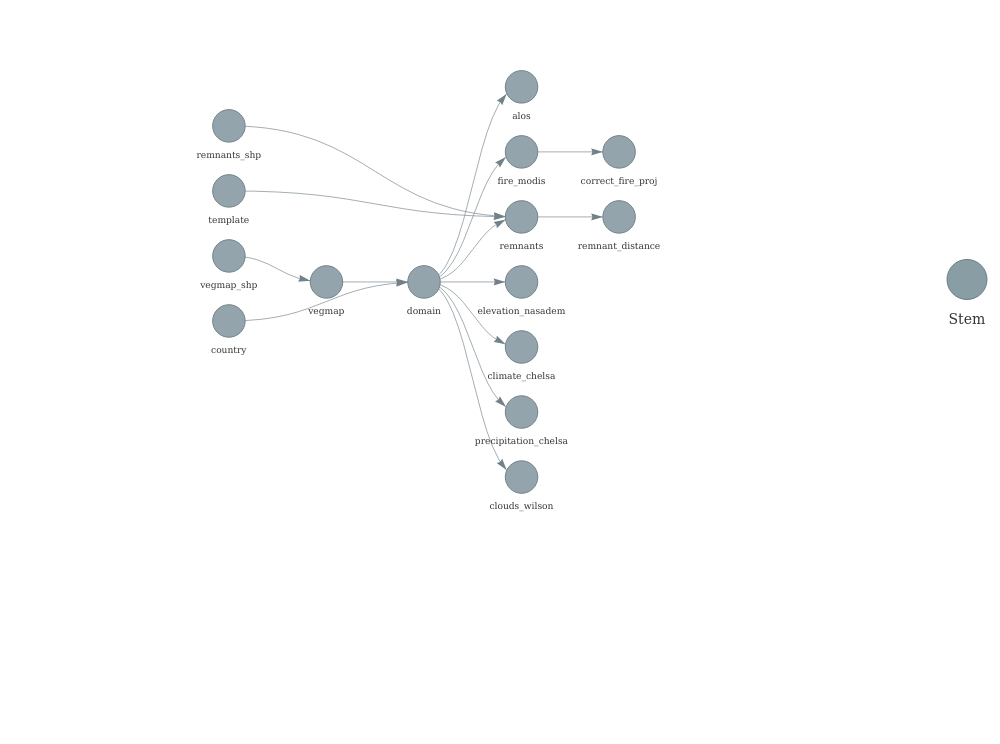

# Ecological Monitoring and Management Application (EMMA)

This is the core repository for environmental data processing in the
Ecological Monitoring and Management Application [EMMA.io](EMMA.io).

## File structure

The most important files are:

``` r
├── _targets.R (data processing workflow and dependency management)
├── R/
├──── [data_processing_functions]
├── data/
├──── manual_download (files behind firewalls that must be manually downloaded)
├──── raw_data (raw data files downloaded by the workflow)
├──── processed_data (data processed and stored by the workflow)
└── Readme.Rmd (this file)
```

Files generated by the workflow are stored in the targets-runs branch.
The final output of the workflow is a set of parquet files stored as
Github releases with the tag “current”.

# Workflow structure

<!-- -->

# Workflow Notes

## Runtime and frequency

Github places some constrains on actions, including memory limits and
run time limits. To prevent this workflow from taking too long to run
(and thereby losing all progress), there are a few key parameters that
can be changed. In the \_targets.R file, the argument “max_layers”
controls the maximum number of layers that rgee will attempt to download
in one action run. When initially setting up the repo, it may be
necessary to lower this value and increase the frequency that the
targets workflow is run (by adjusting the cron parameters in
targets.yaml).

# Data notes

    * MODIS NDVI values have been transformed to save space.  To restore them to the original values (between -1 and 1), use (x/100)-1

# Extras

    * Call `targets::tar_renv(extras = character(0))` to write a `_packages.R` file to expose hidden dependencies.
    * Call `renv::init()` to initialize the `renv` lockfile `renv.lock` or `renv::snapshot()` to update it.
    * Commit `renv.lock` to your Git repository.
