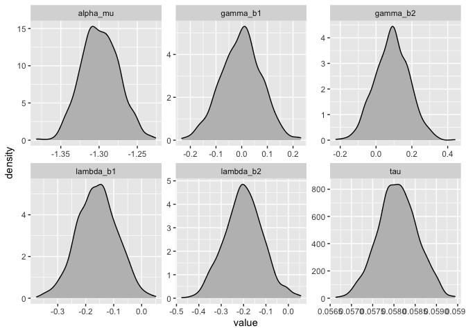
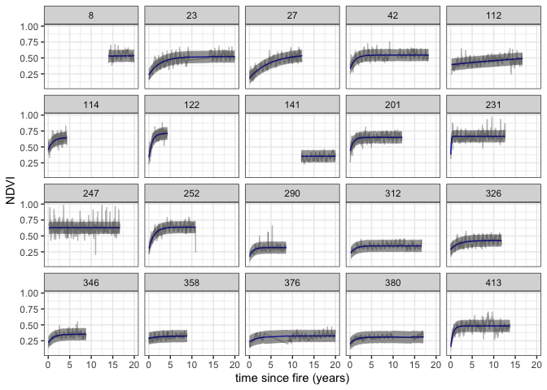

EMMA Prototype
================
true
10-13-2021

The details are given in
\[@slingsby\_near-real\_2020;@wilson\_climatic\_2015\], but in short
what we do is estimate the age of a site by calculating the years since
the last fire. We then fit a curve to model the recovery of vegetation
(measured using NDVI) as a function of it’s age. For this we use a
negative exponential curve with the following form:

$$\\mu\_{i,t}=\\alpha\_i+\\gamma\_i\\Big(1-e^{-\\frac{age\_{i,t}}{\\lambda\_i}}\\Big)$$

where *μ*<sub>*i*, *t*</sub> is the expected NDVI for site *i* at time
*t*

The observed greenness *N**D**V**I*<sub>*i*, *t*</sub> is assumed to
follow a normal distribution with mean *μ*<sub>*i*, *t*</sub>
*N**D**V**I*<sub>*i*, *t*</sub> ∼ 𝒩(*μ*<sub>*i*, *t*</sub>, *σ*<sub>)</sub>

An additional level models the parameters of the negative exponential
curve as a function of environmental variables. This means that sites
with similar environmental conditions should have similar recovery
curves. The full model also includes a sinusoidal term to capture
seasonal variation, but lets keep it simple here.

## ADVI

We have `age` in years, a plot identifier `pid`. the observed ndvi `nd`
and two plot level environmental variable `env1`, which is mean annual
precipitation, and `env2`, which is the summer maximum temperature.

Lets load up our Stan model which codes the model described above. This
is not a particularly clever or efficient way of coding the model, but
it is nice and readable and works fine on this example dataset

``` r
model_output$print()
```

    ##     variable     mean   median    sd   mad       q5      q95
    ##  lp__        25741.47 25752.35 92.50 29.50 25687.13 25794.10
    ##  lp_approx__   -79.60   -79.35  8.74  8.87   -94.59   -65.92
    ##  alpha[1]       -1.50    -1.50  0.02  0.02    -1.53    -1.47
    ##  alpha[2]       -1.53    -1.53  0.02  0.02    -1.56    -1.51
    ##  alpha[3]       -1.21    -1.21  0.01  0.01    -1.24    -1.19
    ##  alpha[4]       -0.98    -0.98  0.01  0.01    -1.00    -0.96
    ##  alpha[5]       -1.35    -1.35  0.03  0.03    -1.39    -1.31
    ##  alpha[6]       -1.33    -1.33  0.02  0.02    -1.36    -1.31
    ##  alpha[7]       -1.09    -1.09  0.01  0.01    -1.11    -1.08
    ##  alpha[8]       -0.55    -0.55  0.01  0.01    -0.56    -0.54
    ## 
    ##  # showing 10 of 36155 rows (change via 'max_rows' argument or 'cmdstanr_max_rows' option)

How long did that take?

``` r
model_output$time()$total
```

    ## [1] 31.70943

``` r
params=c("tau","alpha_mu","gamma_b2","gamma_b1","lambda_b1","lambda_b2")
posteriors=model_output$draws(params) %>% 
  as_tibble() %>% 
  gather(parameter)
ggplot(posteriors,aes(x=value))+
  geom_density(fill="grey")+
  facet_wrap(~parameter,scales = "free")
```

<!-- -->

When we make this comparison, the posterior predictive intervals from
ADVI and MCMC are almost identical

``` r
posterior_summary %>% 
    filter(pid %in% as.numeric(sample(levels(as.factor(posterior_summary$pid)),20))) %>% # just show a few
  ggplot(aes(x=age)) +
  geom_line(aes(y=mean),colour="blue") +
  geom_line(aes(y=nd),colour="black",lwd=0.5,alpha=0.3) +
  geom_ribbon(aes(ymin=q5,ymax=q95),alpha=0.5)+
  facet_wrap(~pid) +
  xlim(c(0,20))+
  labs(x="time since fire (years)",y="NDVI") +
  theme_bw()
```

    ## Warning: Removed 245 row(s) containing missing values (geom_path).

    ## Warning: Removed 245 row(s) containing missing values (geom_path).

<!-- -->

# Spatial Predictions

``` r
stan_spatial <- stan_vb %>% 
  mutate(pid=gsub("[]]","",gsub(".*[[]","",variable))) %>% 
  bind_cols(select(data,x,y,age,nd))

foreach(t=unique(raw_data$DA),.combine=stack) %do% {
stan_spatial %>% 
    filter(DA=t) %>%
    select(x,y,age,nd,mean,q5) %>% 
    rasterFromXYZ()
}
```
